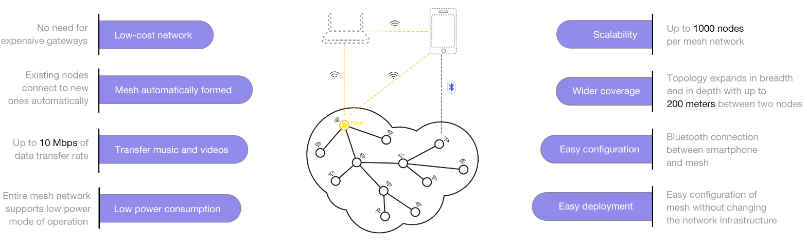

<!-- class: invert -->

<h1 id="titleH1">Data for Edge-Based Microservices</h1>
<h2 id="titleH2">IoT Phase-2 Project</h2>
<h3>Team 12</h3>

---

# Project Overview

- A simple Ad-Hoc (mesh) network is setup using the ESP-MESH.
- One static node acts as a bridge between Mesh network and network gateway.
- MQTT Broker acts as both pub/sub client and server.
- Bridge node broadcasts application subscriptions, Edge devices update filter lists.
- Context aware sensor data is aggregated at MQTT broker.

---
# Networking Aspect

---
# Networking Aspect
- ESP-MESH is a protocol used to form a self-forming and self-healing network.
- It is secure by design as it is based on IEEE 802.11(WiFi) and can use WPA2.
- Each Node turns on both Access Point (AP) and Station (STA) modes to form the network. The Protocol also updates and maintains routing tables and physoical topology of the network itself on each node.

---
# Algorithm Aspect

---
# MQTT Aspect
- Program exists in such a way that connection is established to *HIVEMQ* (Cloud MQTT server). If it fails, the connection falls back to local MQTT server running on the gateway itself.
- Cloud access should be secure, so generated SSL/TLS certs are loaded locally on the bridge, which synchronises time from the internet to every node on the network. This ensures the secure connection isn't rejected by the remote broker.
- Bridge subscribed to all channels, applications subscribe to the channel of their preference.